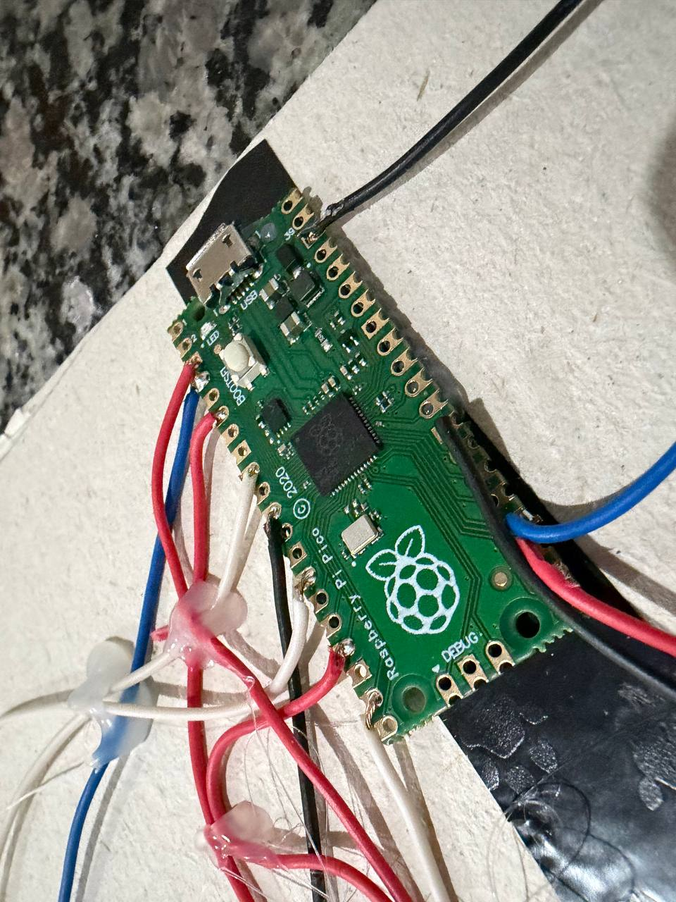
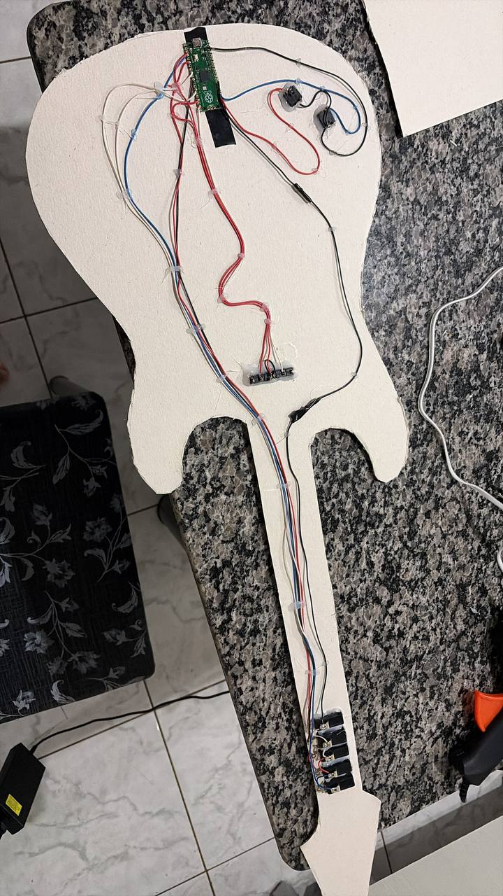
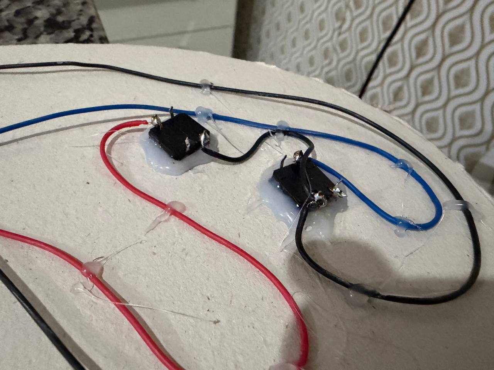
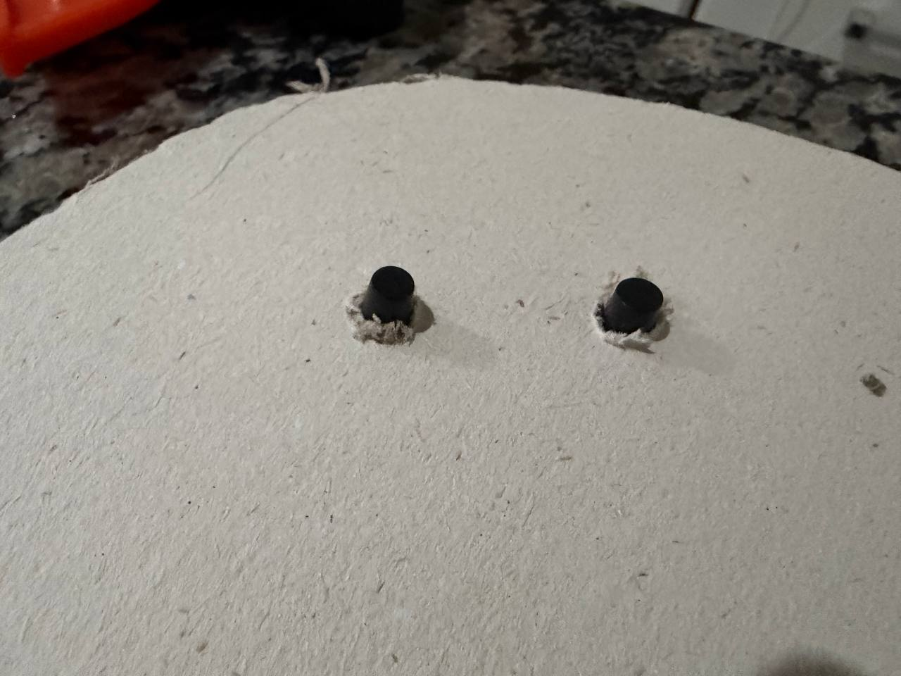
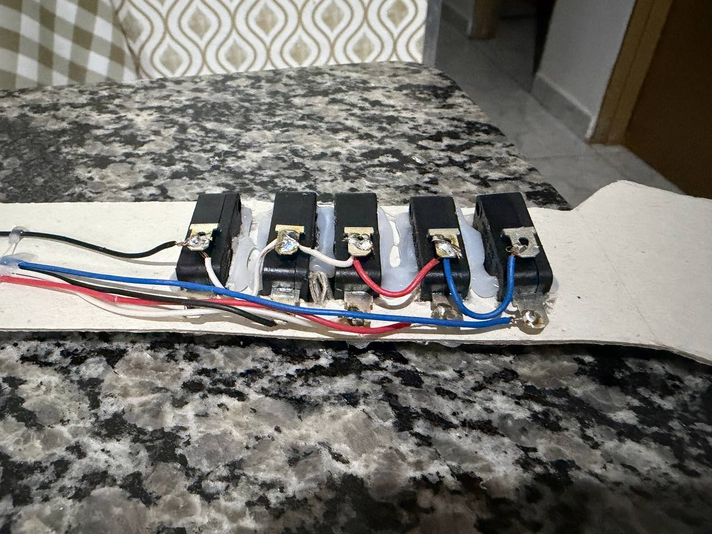
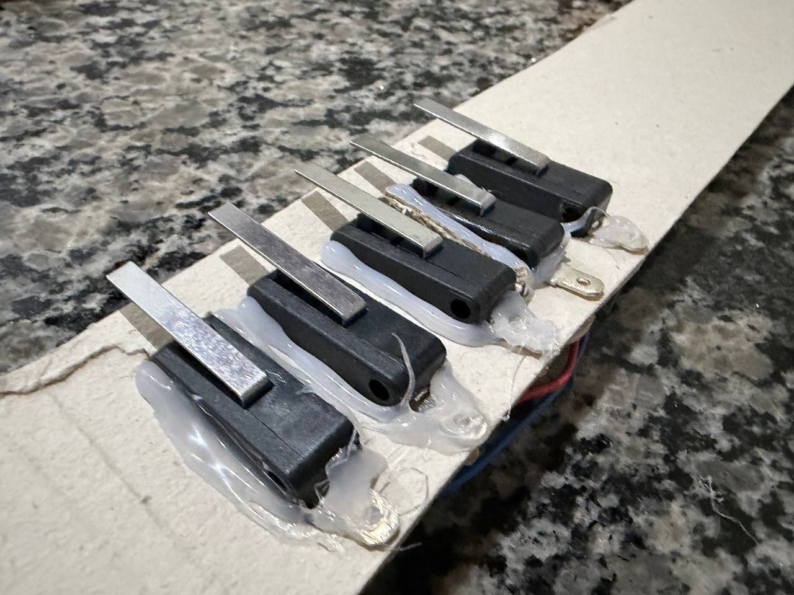
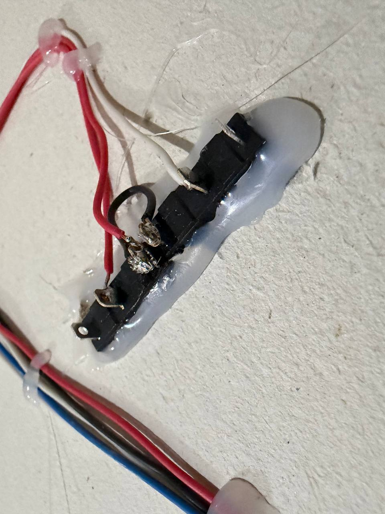
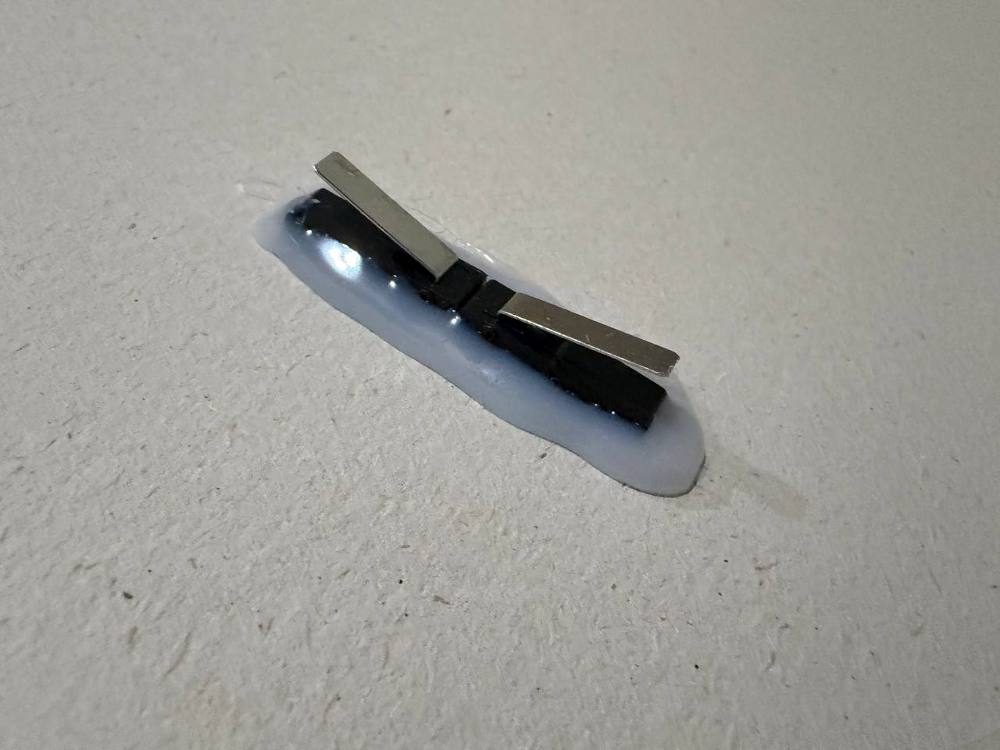
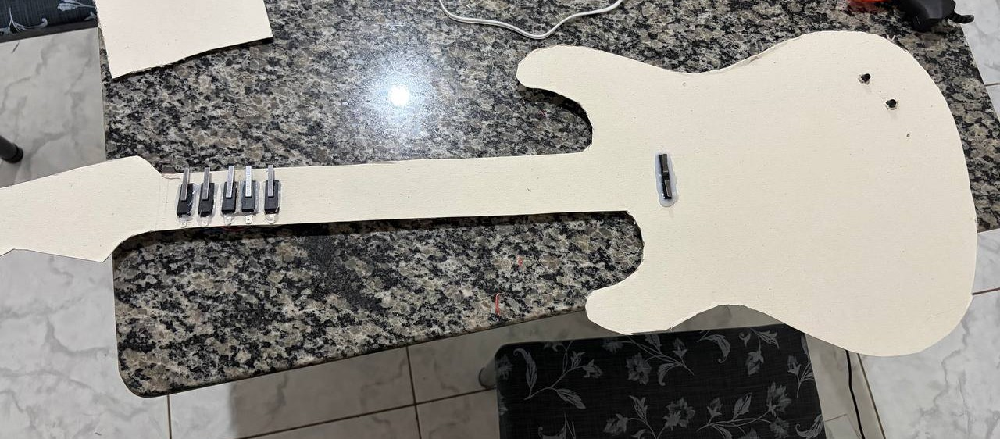

# raspberry-guitar-controller

Here I documented our DIY Guitar Controlle, made using switches, a Raspberry Pi Pico and a paperboard structure.

This is the second project for the Eletronics for Computer Science class.

## Materials
- 1x Raspberry Pi Pico (RP2040)
- 5x Micro Switches (Long Hinge) - For fret buttons
- 2x Micro Switches (Short Hinge) - For Strum Bar
- 2x Tactile Switches - For Start and Select 
- 1x Micro USB cable
- 0.14mm^2 Copper cables

## Tools
- Soldering iron (30W)
- Hot glue gun
- Paperboard
- Electrical tape
- Scissors
- Knife

## Wiring
This project uses a pull-up approach. All "COM" pins on the switches are tied to GNDs on the Pico. The "NO" (Normally open) pins are wired to individual GPIOs. 

## Buttons

## Frets

## Strum Bar

## Full guitar

## Software
The brain of the guitar runs on the amazing Santroller firmware.

https://santroller.tangentgamer.com/

It turns the Pico into a videogame controller.

## Credits

Project members:

- Ryan Sulino Arrua - 16900070

- Lucas Vinicius da Costa - 16885265

- Luiz Filipe Sa Vioto - 16886252

- Luis Gustavo Vieira Antoniosi - 17067476

